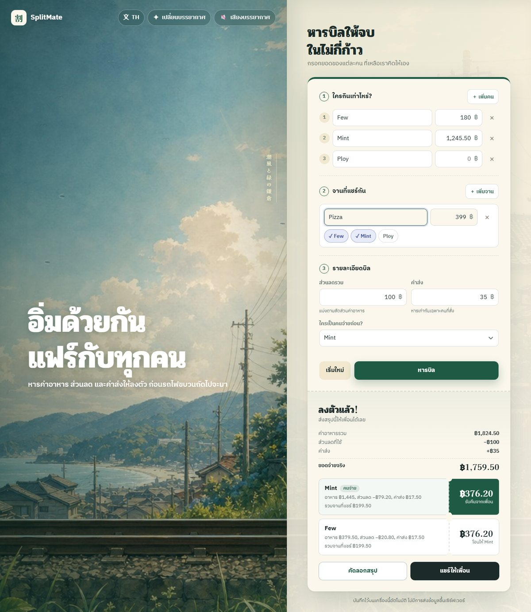
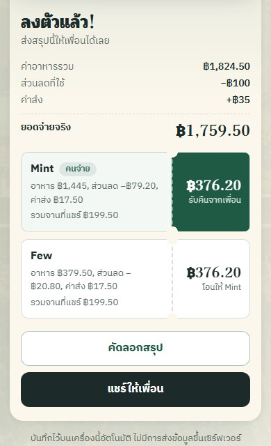

# SplitMate 🌿

### Split a shared meal fairly, with shared dishes, discounts, and delivery all included.

**[Open SplitMate](https://panyawat56.github.io/splitmate/)**

Free, no sign-up, nothing to install. Works on your phone.

**ไทย** · **English** · **日本語** · **中文**

---

## What it does

You ordered food together, one friend paid, and now everyone needs to pay them back. SplitMate works out exactly how much each person owes:

- **Your own dishes** are counted for you alone.
- **Shared dishes**, like a pizza or a hot pot, are split equally between the people who had them.
- **Discounts and coupons** are shared in proportion to how much each person ordered, so a big order gets a bigger slice of the discount.
- **Delivery fees** are split equally between the people who ordered something.

Each person gets a ticket that says how much to transfer and to whom. Copy the summary or share it straight to your group chat.

## How to use it

1. Open **[SplitMate](https://panyawat56.github.io/splitmate/)**.
2. Enter each person's name and the price of what they ordered for themselves.
3. Under **Shared dishes**, add anything you shared and tap the names of the people who had it.
4. Enter the total discount and the delivery fee, and choose who paid.
5. Tap **Split the bill**.
6. Tap **Copy summary** or **Share** to send the result to your friends.

Once you've split the bill, the result updates as you type, so you can fix a typo without starting over. Amounts can include commas, such as `1,245.50`.

## A worked example

Few, Mint, and Ploy are on the order. Mint pays the ฿1,759.50 total.

| | Few | Mint | Ploy |
|---|---:|---:|---:|
| Own dishes | ฿180.00 | ฿1,245.50 | nothing |
| Pizza ฿399, shared by Few and Mint | ฿199.50 | ฿199.50 | |
| **Food subtotal** | **฿379.50** | **฿1,445.00** | |
| ฿100 discount, by share of food | −฿20.80 | −฿79.20 | |
| ฿35 delivery, split between people who ordered | ฿17.50 | ฿17.50 | |
| **Share of the bill** | **฿376.20** | **฿1,383.30** | **฿0** |

Result: **Few transfers ฿376.20 to Mint.** Ploy didn't order anything, so Ploy isn't charged for delivery.

## How the math works

- All amounts are calculated in whole satang (฿0.01), so there are no floating-point rounding surprises.
- When an amount can't be split evenly, the leftover satang go to people in a fixed, predictable order. Everyone's shares always add up to the exact bill.
- If the discount is bigger than the food total, it's capped at the food total.

## Privacy

Everything happens in your browser. Your bill is saved on your own device so it's still there if you close the tab, and **Start over** clears it. SplitMate has no server, no account, no analytics, and doesn't collect any data.

## Also included

- Thai, English, Japanese, and Simplified Chinese
- Works with a keyboard and screen readers, and respects your device's reduced-motion setting
- An illustrated Kamakura summer scene with a passing Enoden train, plus optional koto and wind-chime sounds (off by default)

## Run it yourself

SplitMate is a single HTML file with no build step and no dependencies.

    git clone https://github.com/panyawat56/splitmate.git
    cd splitmate

Open `index.html` in a browser, or serve the folder with any static file server. It needs an internet connection only for its web fonts.

    .
    ├── index.html    # the whole app: layout, styles, calculations, translations, scene, sound
    ├── assets/       # Kamakura background artwork
    └── docs/         # screenshots used in this README

Found a bug or have an idea? [Open an issue](https://github.com/panyawat56/splitmate/issues).

## License

[MIT](LICENSE) © 2026 Panyawat Piriyaniti. You're free to use, copy, and modify the code as long as the license notice stays with it.
